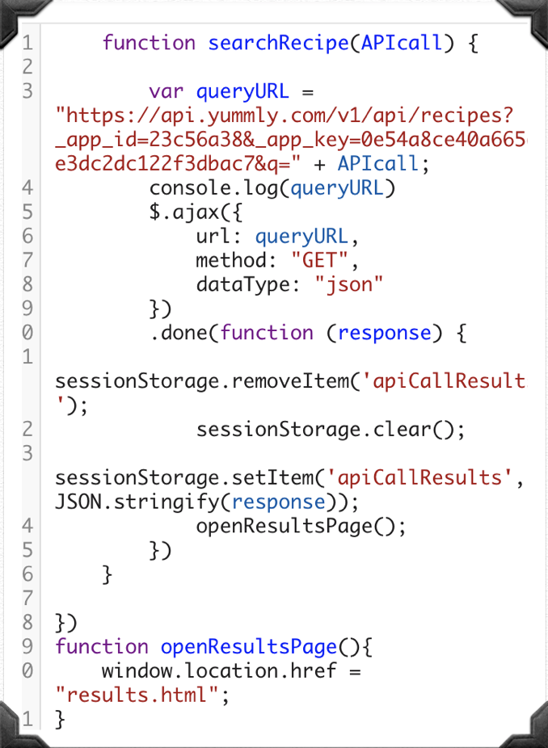

# GroupProject1

---------------------------------------------------------------------------------------------------------------------------------------------

Project Title: Quick Recipes

---------------------------------------------------------------------------------------------------------------------------------------------

"Back End"

  Search Function:
    Logan Geoffrion
  
  Wine API
    Shankarri Ragavan

  Heroku & Yummly API:
    Beckett Witzke

  Index:
    Taylor Hrypa

  Results/Readme:
    Mitchell Burr

---------------------------------------------------------------------------------------------------------------------------------------------

Project Description:
Our application pulls recipe results from Yummly's API based on recipe name or by ingredient. Then, it will list the recipe 
ingredients and it includes a button to the instructions for the recipe. It will also compare the ingredients and search for 
wine pairings from a second API. 

---------------------------------------------------------------------------------------------------------------------------------------------

Code Snippet: 

can be found at searchFunction.js 123

---------------------------------------------------------------------------------------------------------------------------------------------

APIs used:

Yummly

Spoonacular

---------------------------------------------------------------------------------------------------------------------------------------------

New technology:

Heroku w/ guide

https://docs.google.com/document/d/1bbCMnYzKWfgkwbYafPzusjOJKjrZ9d_BvA4HTJAHVQg/edit?usp=sharing

---------------------------------------------------------------------------------------------------------------------------------------------